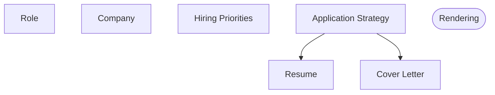

# Project Summary

## Goals

1. Have an easily editable set of related documents
    - Content maintained as structured data
    - Template can render from data easily
2. Tailor documents for roles / organizations via AI
    - Parse a job description / company profile and determine priorities to convey via the documents
    - Choose from inventory of content which to include
3.

## Documents

Scoped documents for each role are within JDs/....

| Document             | Kind     | File               |
|----------------------|----------|--------------------|
| Job Description      | Input    | role.json          |
| Company Info         | Input    | company.json       |
| Hiring Priorities    | Artifact | hr_priorities.json |
| Application Strategy | Artifact | app_strategy.md    |
| Resume               | Output   | resume.pdf         |
| Cover Letter         | Output   | letter.pdf         |

Process:

Input: Link to Job Posting

1. Scrape Posting
    2. Extract Company Identity, Application, Misc
    3. Extract JD - background, tech stack, responsibilities, ownership
    4. Extract benefits - pay range, stock,
2. Fetch context of company and role in company
    2. Search for employees who work at this company.
    3. Search for company details - size, sector, age, public, investment, maturity
    4. Search for financial details of company
4. Reconcile into a role centric graph 
2. Estimate the size of the organization, where the role fits in the org chart, responsibilties, and sector / users,
   Maturity, Public, etc

4. You are a hiring manager for this role at this company,
    1. what are your priorities in candidates.
    2. What are your red flags
    3. what kinds of projects will this person work on, tech stacks, etc
    4. how formal / corporate is this role
5. Given my background and these priorities:
    6. What do you highlight
    7. what do you not mention
    8. what story do you tell
    9. What is relevant to their business
    10. What gaps are there between me and their ideal candidate.
6. Resume Crafter
    7. With these directives, choose whether each line item should be included.
    8. Within each role reorder line items if desired.
    9. If any line items should be modified, request modifications
    10. Choose from language by formalness
11. Cover Letter Crafter
    12. Reconcile narrative with core parts
    13. Use language approrpriate for organization
    14. Revise for errors or missing info.
15. As hiring manager, review these documents for concerns / missing qualifications
    16. list them and their significance
