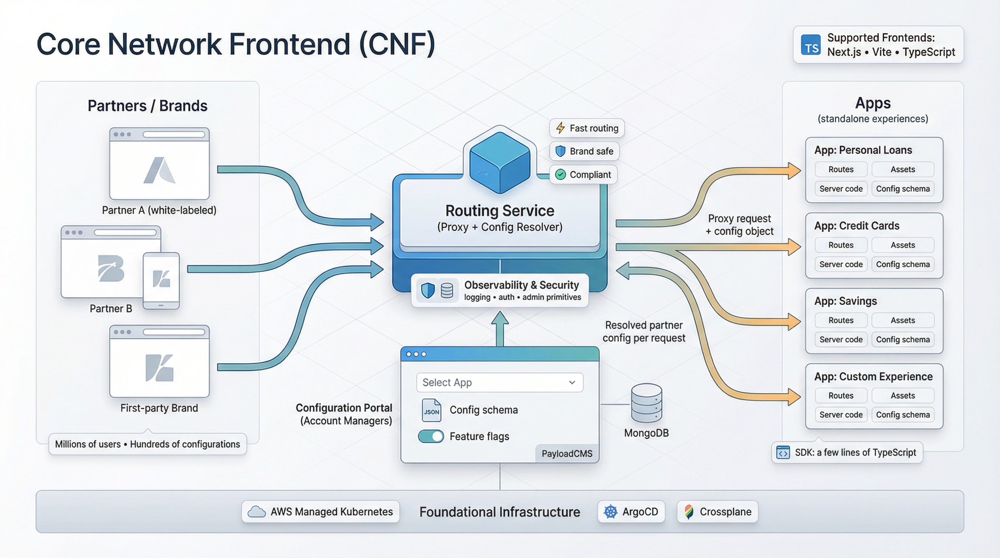

# Core Network Frontend (CNF)

Core Network Frontend was a platform for Even Financial to provide customizable, white-labeled user experiences for our partners while remaining compliant and brand safe. It was developed in late 2023 and was successfully in operation by early 2024. It drastically reduced the complexity of creating new experiences for contractors and improved quality, performance and security for users and partners.

## Goal

Design, Implement and Rollout a system to efficiently serve customizable experiences that can be developed by anyone, while benefiting from core platform features like security, logging and administration. 

### Context

- Millions of users daily
- Hundreds of partner configurations
- Multiple first party brands
- A Legacy codebase with a single bundle
- No remaining senior staff
- 10s+ load times, 25% drop off before page load
- No documentation and difficult to safely develop in

## Role 

I was the architect, product owner and lead developer for this project. Throughout the project, I worked closely with other product managers and account managers to ensure features were aligned with business goals and prioritized by value. Due to staffing changes, all other developers were let go early on, and for the majority of the project I was the only contributor until a staff engineer and contractors were hired during initial rollout. 

## Problems to Solve

1. Enable simple and safe deployments of new experiences without the developer leaving Typescript or the repository.
2. Standardize routing and configuration infrastructure without impacting performance and flexibility
3. Transition existing traffic and ensure feature parity
4. Keep fundamental primitives aligned with non-technical stakeholders

## Architecture
 
1. Each product vertical or independent experience is it's own standalone App. So the business decides the boundaries. 
2. Each App contains its own configuration schema, exposed routes, assets and server code. 
   1. Apps are provided their configuration as part of each request
   2. CNF provides an SDK to make this just a few lines of code
3. A Configuration portal allows account managers to create partner specific configurations based on available apps. 
4. A Routing service proxies each request to the appropriate App, with the resolved configuration object

### Technologies
- Foundational Infrastructure
  - AWS Managed Kubernetes
  - Traefik Proxy
  - ArgoCD
  - Crossplane
- Configuration and Routing Services
  - Typescript
  - H3 / Nodejs
  - PayloadCMS
  - MongoDB
- Supported Frontend Frameworks
  - Nextjs
  - Vite
  - Typescript

